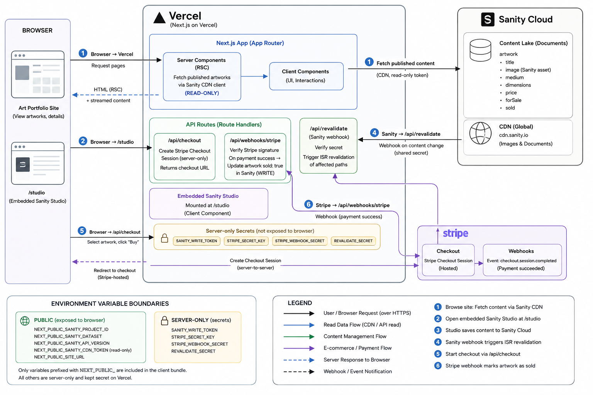

# Art Portfolio

An artist portfolio and e-commerce site for a Matthews, NC mixed-media/painting artist with an "Appalachian low-country punk" aesthetic. Built to display work now, sell it later (Phase 2).

## Stack

- **Next.js 16** (App Router) — hosted on Vercel
- **TypeScript** with path alias `@/*` → `src/*`
- **Tailwind CSS v4** (PostCSS-based)
- **Sanity.io** — CMS with embedded Studio at `/studio`
- **Stripe** — Checkout Sessions + webhook to mark artwork as sold

This site runs at **$0/month** — see [COSTS.md](COSTS.md) for the per-service breakdown and the
one gotcha (Sanity member roles) to watch when the trial converts to the Free plan.

## Architecture



Key data flows:

1. Server Components fetch published artworks via `sanityFetch` (Sanity Live Content API), so Studio edits appear on the site without a redeploy or refresh
2. The embedded Sanity Studio (`/studio`) manages artwork documents
3. Sanity webhooks hit `/api/revalidate` as a fallback if a visitor's live connection drops
4. Stripe Checkout Sessions handle purchases; Stripe webhooks hit `/api/webhooks/stripe` to set artwork `status: "sold"` via a server-only write token

## Getting Started

```bash
cp .env.local.example .env.local   # fill in required variables
npm install
npm run dev                         # localhost:3000, Studio at /studio
```

## Environment Variables

| Variable                             | Purpose                                              |
| ------------------------------------ | ---------------------------------------------------- |
| `NEXT_PUBLIC_SANITY_PROJECT_ID`      | Sanity project ID                                    |
| `NEXT_PUBLIC_SANITY_DATASET`         | Defaults to `production`                             |
| `SANITY_API_READ_TOKEN`              | Server-side draft/preview fetching                   |
| `SANITY_API_WRITE_TOKEN`             | Marks artwork `sold` from Stripe webhook             |
| `STRIPE_SECRET_KEY`                  | Stripe secret key                                    |
| `NEXT_PUBLIC_STRIPE_PUBLISHABLE_KEY` | Stripe publishable key                               |
| `STRIPE_WEBHOOK_SECRET`              | Signing secret for `/api/webhooks/stripe`            |
| `NEXT_PUBLIC_SITE_URL`               | Base URL for Stripe redirect URLs                    |
| `SANITY_REVALIDATE_SECRET`           | Shared secret for Sanity → `/api/revalidate` webhook |

## Commands

```bash
npm run dev      # start dev server
npm run build    # production build
npm run lint     # ESLint
npm run format   # Prettier
```

## Project Structure

```
src/
├── app/
│   ├── studio/[[...tool]]/    # Embedded Sanity Studio
│   ├── api/
│   │   ├── checkout/          # Creates Stripe Checkout Sessions
│   │   ├── webhooks/stripe/   # Handles payment success, marks artwork sold
│   │   └── revalidate/        # ISR revalidation triggered by Sanity webhook
│   ├── layout.tsx
│   └── page.tsx
└── sanity/
    ├── lib/
    │   ├── client.ts          # CDN client + preview client
    │   ├── image.ts           # urlFor() helper
    │   └── queries.ts         # All GROQ queries
    └── schemaTypes/
        ├── artwork.ts         # title, slug, image, medium, dimensions, year,
        │                      # category, description, featured, forSale, price, sold
        ├── category.ts
        └── index.ts
```

## Deploying to Vercel

1. Push to GitHub and import the repo in Vercel
2. Add all environment variables in Vercel project settings
3. In Sanity → API → CORS origins, add the Vercel deployment URL
4. Set up Stripe webhook pointing to `https://<your-domain>/api/webhooks/stripe`
